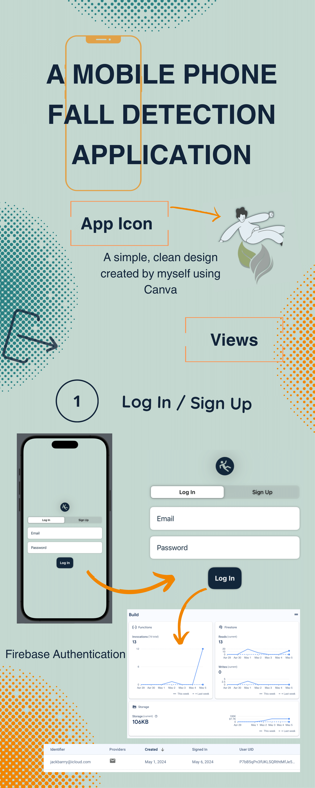
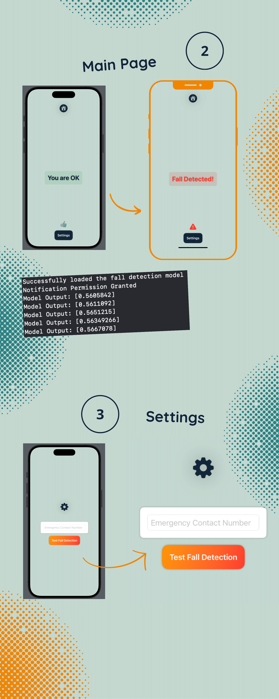
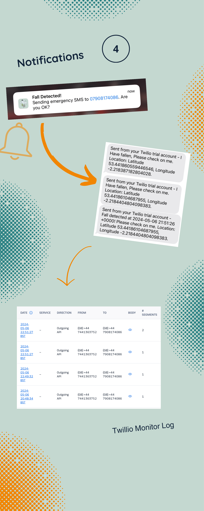

# BSc Computer Science Honours Project - Fall Detection Application

As the culmination of my final year university dissertation project, I developed a live iOS fall detection application using XCode. This application employs a Multi-Layer Perceptron model trained in Google Colab using the UR Fall Public Dataset to achieve real-time detection of falls, leveraging data from iPhone sensors. This approach not only ensures rapid detection but also enhances user safety in critical situations.

In addition to the machine learning component, the project integrates Google Firebase for cloud authentication, maintaining secure user management and data handling. Twilio is utilised to facilitate efficient SMS-based emergency alerts, providing immediate notifications to designated contacts in case of a fall event.

This project represents a significant milestone in my academic journey, highlighting my dedication to leveraging technologies in which to address real-world challenges within the mobile health application field.

